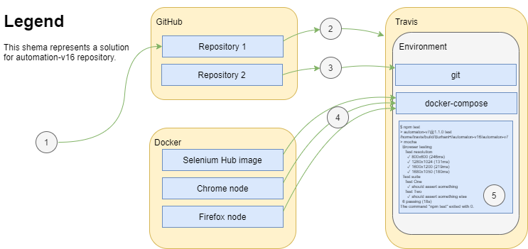

# Automaton-v16
Automation testing infrastructure - an example. Based on Docker and [one auto test repository](https://github.com/BurhanH/automaton-v7).

## Concept
The main idea was to create a virtual infrastructure to execute automated tests based on Selenium.
I use Travis CI as a CI/CD service and environment, in this environment I use 2 configuration files. One configuration file for Travis CI, this file describes steps and actions to prepare the environment. Second configuration file for Docker, Docker uses this file to create a virtual infrastructure - Selenium Grid which contains Selenium Hub and 2 nodes, one node as Firefox browser, another one as Chrome browser.

## Advantages
- No need to handle browser versions and drivers (Just specify a browser image in a config file)
- You may run tests parallel (Will decrease total runtime!)
- You may scale infrastructure easily (Tip! `docker-compose scale chrome=5` or `docker-compose scale firefox=5`, etc.)

## Disadvantages
- You need enough capacity to create a huge infrastructure
- I still have no idea how to get logs (artifacts) from Travis CI

## Shema
  

Step 1: The initial step. Configurations for the test infrastructure belong and exist in Repository 1.  
Step 2: Actual configurations deploy in Travis CI.  
Step 3: Deploy a code (an application, a service, etc.). Repository 2.  
Step 4: Up the test infrustructure.  
Step 5: Run tests.  

## Technology stack and documentation
[Docker](https://docs.docker.com/compose/)  
[GitHub](https://help.github.com/en)  
[Selenium Grid](https://www.selenium.dev/documentation/en/grid/)  
[Travis](https://docs.travis-ci.com/)  
